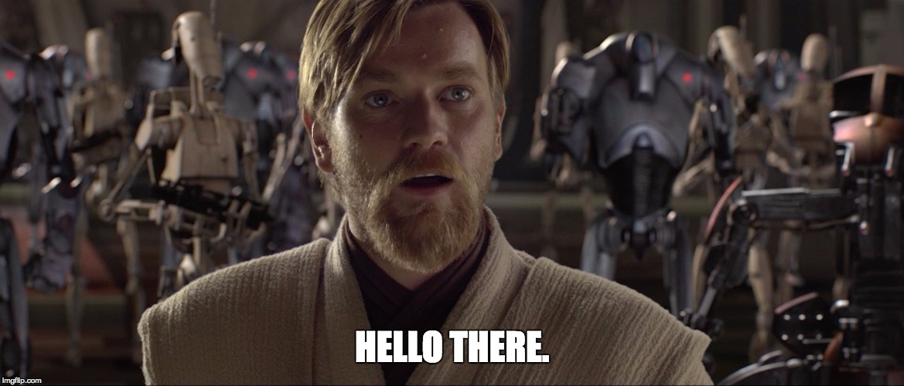

Welcome to my page! I'm Dominique (♂️), Software developer since 2016.

## 😀 About me

- Name's Dominique
- Male
- Born and living in 🇩🇪Germany @ 1995
- B.Sc. in Computer Science
- I love video games

## 👀 What I'm interested in

- JavaScript & TypeScript
- React
- Linux ❤
- Cloud computing platforms like AWS & Azure
- Home automation ([Home Assistant](https://www.home-assistant.io/) rocks!)
- Game development

## 📚 What I'm currently learning

(Could be outdated, last update: November 2021)

- [React NodeGui](https://github.com/nodegui/react-nodegui) (tl;dr: Electron without a browser)
- Running home automations with [AppDaemon](https://appdaemon.readthedocs.io/en/latest/)
- Developing mods for [s&box](https://sbox.facepunch.com)

## 📫 Contact

You can reach me at dominique@mattern.dev
